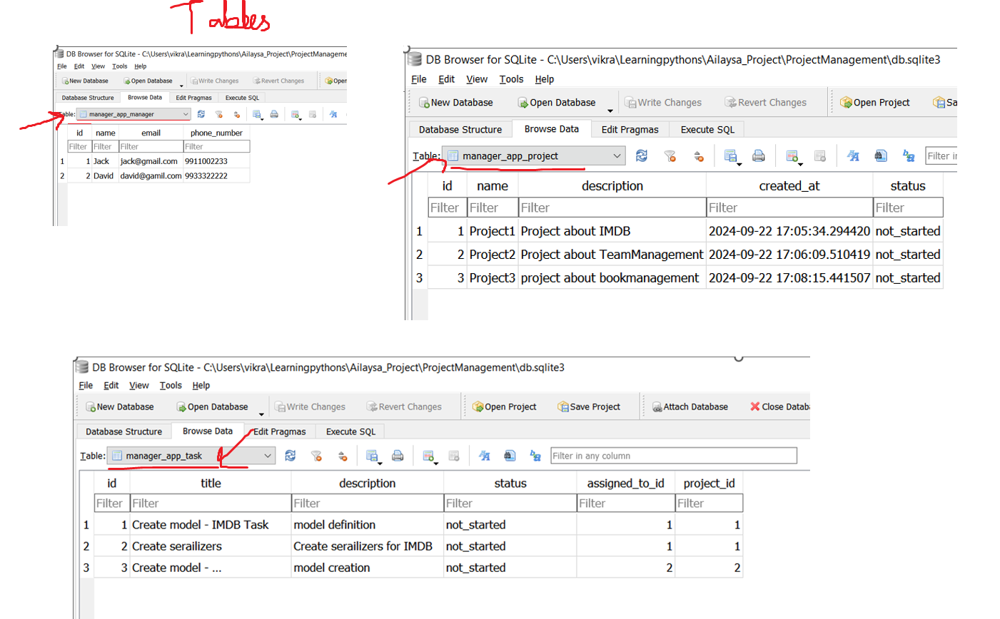
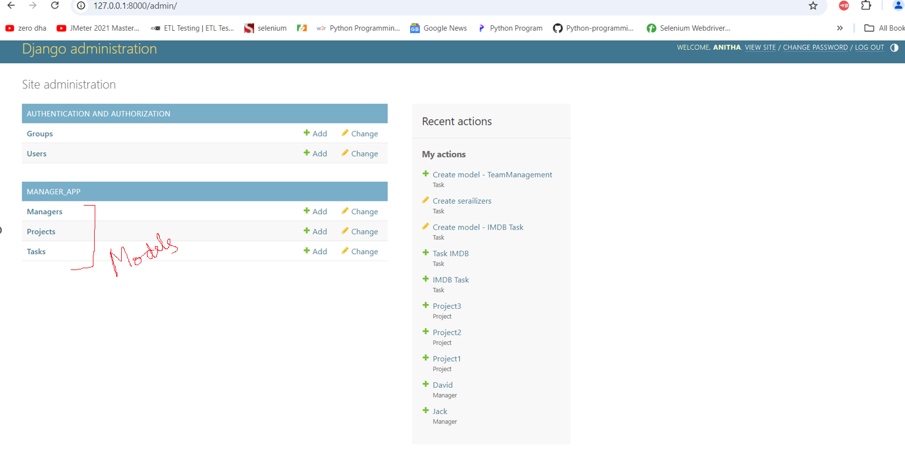
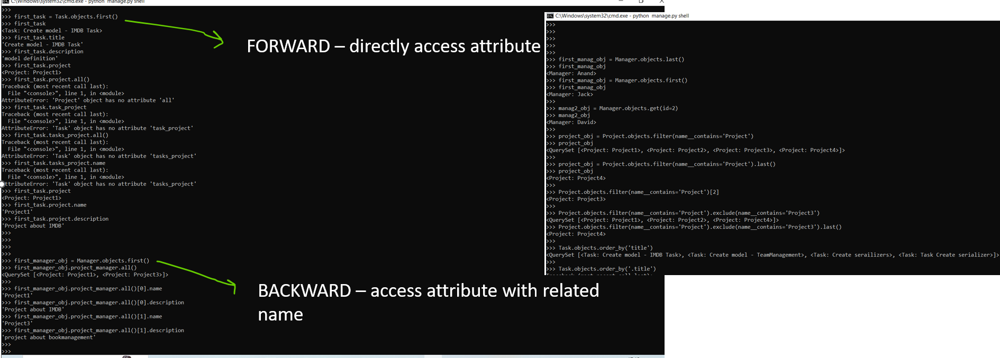
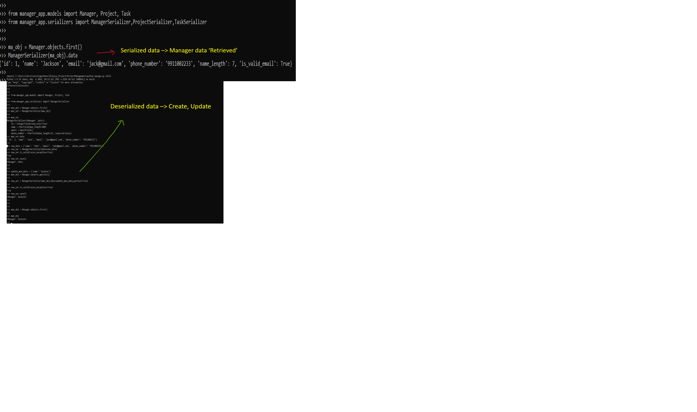
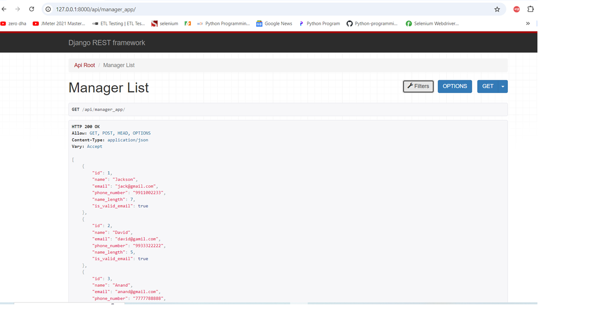
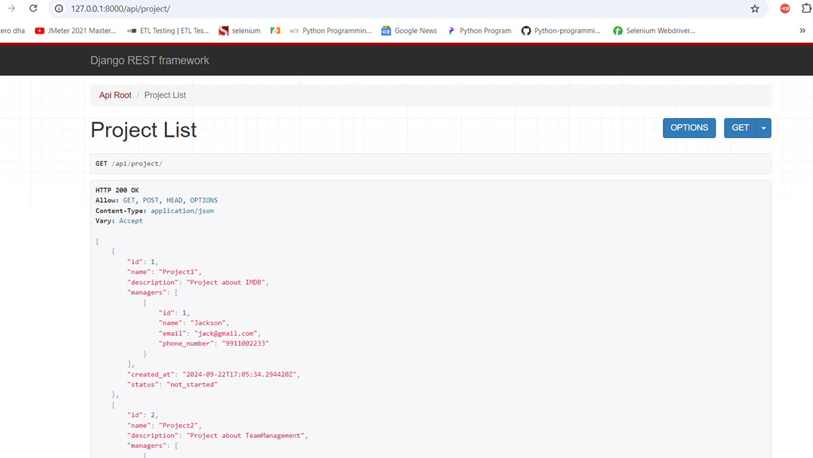
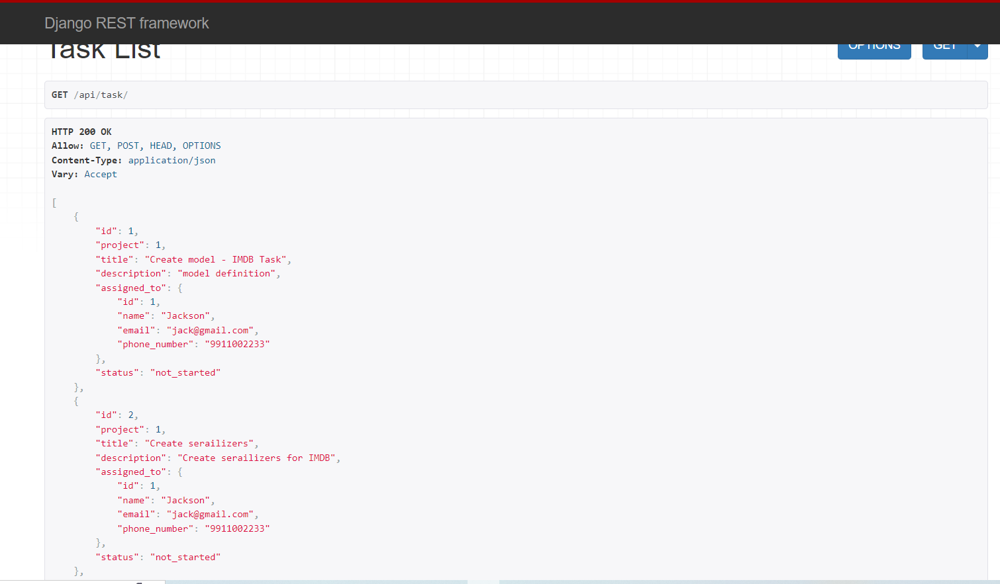

PROJECT : PROJECT TEAM MANAGEMENT - Built web API's using Django and DjangoRest framework. 

WORKFLOW: 
1. MODEL AND RELATIONSHIP

2. Django ORM

3. Serializer & DeSerializer. 

4. API's for application

